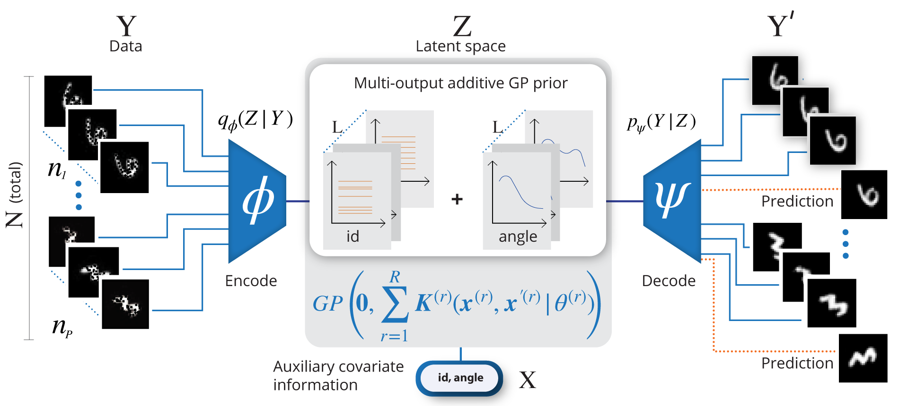

Longitudinal Variational Autoencoder
===========================================================================================
This repository contains the python scripts used in our [paper](http://proceedings.mlr.press/v130/ramchandran21b.html) published in the Proceedings of the 24th International Conference on Artificial Intelligence and Statistics (AISTATS) 2021, San Diego, California, USA.

Overview
--------
In this work, we propose the Longitudinal VAE (L-VAE), that uses a multi-output additive Gaussian process (GP) prior to extend the VAE's capability to learn structured low-dimensional representations imposed by auxiliary covariate information, and  derive a new KL divergence upper bound for such GPs. Our approach can simultaneously accommodate both time-varying shared and random effects, produce structured low-dimensional representations, disentangle effects of individual covariates or their interactions, and achieve highly accurate predictive performance.<br/><br/><br/>

<br/><br/>
The figure shows the Health MNIST dataset as an example. We apply an additive GP prior in the latent space using the auxiliary covariate information. Our model can perform the imputation of missing values as well prediction of missing instances. See the manuscript for more details.

Poster
------
<br/>

<br/>


Prerequisites
---------------
These scripts require the following software:
- Python (>= 3.6.0)
- [PyTorch](https://pytorch.org) (>= 1.7) and associated dependencies.
- [GPyTorch](https://gpytorch.ai) (>= 1.3)

Downloading MNIST digits
------------------------
- Download and unzip archive from here: https://www.dropbox.com/s/j80vfwcqqu3vmnf/trainingSet.tar?dl=0

Generating Health MNIST experiment data
---------------------------------------
- To create training/test data, labels as well as mask, run:
		`python Health_MNIST_generate.py --source=./trainingSet --destination=./data --num_3=10 --num_6=10 --missing=25 --data_file_name=train.csv --labels_file_name=labels.csv --mask_file_name=mask.csv --data_masked_file_name=masked_data.csv`
- See `Health_MNIST_generate.py` for configuration.

Using our method
----------------
- Create results folder.
- To **pre-train** the encoder and decoder weights, run:
		`python VAE.py --f=./config/vae_config_filename.txt`

- To run the **L-VAE model**:
		`python LVAE.py --f=./config/lvae_config_filename.txt`

Cite
---------------
Please cite this work as:
```
Ramchandran, S., Tikhonov, G., Kujanpää, K., Koskinen, M., & Lähdesmäki, H. (2021). Longitudinal Variational Autoencoder. Proceedings of the Twenty Fourth International Conference on Artificial Intelligence and Statistics (AISTATS)
```

Authors
---------------
- [Siddharth Ramchandran](https://www.siddharthr.com)
- [Gleb Tikhonov](https://www.researchgate.net/profile/Gleb_Tikhonov)
- [Kalle Kujanpää]()
- [Miika Koskinen](https://www.linkedin.com/in/miika-koskinen-462ab83/)
- [Harri Lähdesmäki](http://users.ics.aalto.fi/harrila/)

License
---------------
This project is licensed under the MIT License - see the [LICENSE](LICENSE) file for details.
